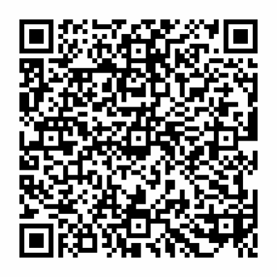

# UPN QR code generator for PHP


[](https://codecov.io/gh/DataLinx/php-upn-qr-generator)

[](http://commitizen.github.io/cz-cli/)


## About
Using this library you can generate a QR code for a UPN payment order, which is used in Slovenia. The technical specification is defined by the Slovenian Bank Association.

This library can output a PNG, SVG or EPS image to a local file.

## Requirements
- PHP >= 7.4
- mbstring and iconv PHP extensions
- imagick PHP extension, but only if you want to generate PNG (raster) QR code images — not required for vector formats (SVG, EPS)

## Installing
Download it with composer:
```shell
composer require datalinx/php-upn-qr-generator
````

## Usage
In order to generate a QR code you need to pass at least these parameters:
* recipientIban
* recipientCity

The minimal required parameters are based on the Android applications ISPS and Banka IN offered by the Intesa Sanpaolo Bank Slovenia. 

See class docblocks for accepted parameter formats and length.

### Sample code
This code shows a typical use-case. See the UPNQR class for more stuff you can put into the QR code.
```php
// Create an instance of the UPNQR class
$QR = new UPNQR();

// Set payer
$QR ->setPayerName("Janez Novak")
    ->setPayerStreetAddress("Lepa ulica 33")
    ->setPayerCity("Koper");

// Set recipient
$QR ->setRecipientIban("SI56020360253863406")
    ->setRecipientName("Podjetje d.o.o.")
    ->setRecipientStreetAddress("Neka ulica 5")
    ->setRecipientCity("Ljubljana");

// Transaction details
$QR ->setAmount(55.58)
    ->setRecipientReference("SI081236-17-34565")
    ->setPurposeCode("GDSV")
    ->setPaymentPurpose("Plačilo spletnega naročila št. 304");

try {
    // Generate QR code image of type svg (use .png for PNG images)
    $QR->generateQrCode("./qrcode.svg");
} catch (Exception $e) {
    throw new Exception("Error generating QR code image: " . $e->getMessage());
}

```
The above code will generate this QR code:



## Contributing
If you have some suggestions how to make this package better, please open an issue or even better, submit a pull request.

The project adheres to the PSR-4 and PSR-12 standards.

The code is fully tested, including OCRing of the generated QR code.

### Developer documentation
* [QR code technical specification](https://upn-qr.si/uploads/files/Tehnicni%20standard%20UPN%20QR.pdf) (see chapter 5.2)

### Changelog
All notable changes to this project are automatically documented in the [CHANGELOG.md](CHANGELOG.md) file using the release workflow, based on the [release-please](https://github.com/googleapis/release-please) GitHub action.

The format is based on [Keep a Changelog](https://keepachangelog.com/en/1.0.0/),
and this project adheres to [Semantic Versioning](https://semver.org/spec/v2.0.0.html).

For all this to work, commit messages must follow the [Conventional commits](https://www.conventionalcommits.org/) specification, which is also enforced by a Git hook. 
